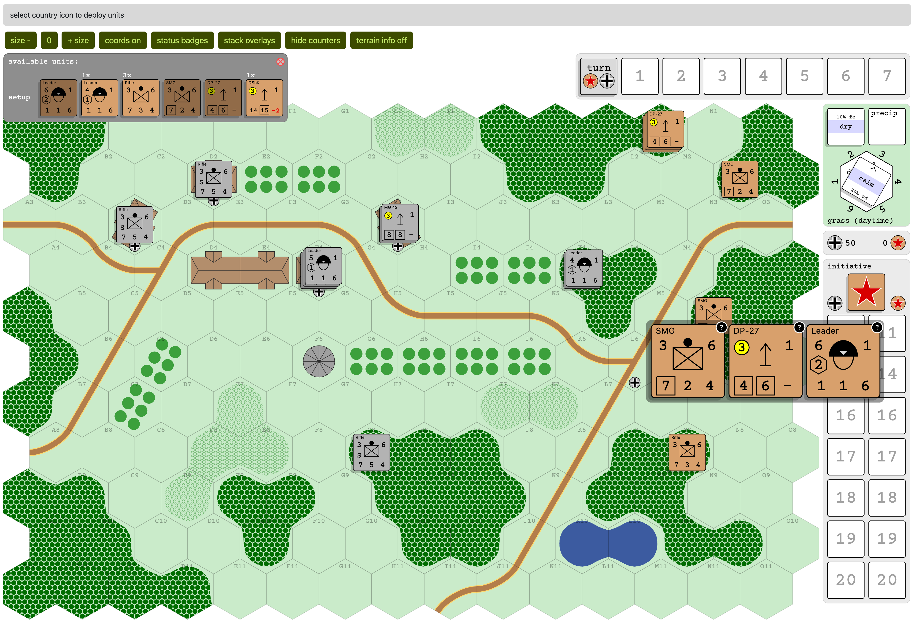

# README

`.tool-versions` has current versions of ruby, nodejs, yarn used.  I use asdf to handle the installs.

Postgresql needs to be installed.

To get the server up and running, run:

```
bundle install
yarn
rake db:create
rake db:migrate
bin/dev
```

There is a git hook in support (`pre-commit`) which runs the linters and specs.  Can just be put in `.git/hooks`.

Probably could do a more to TS-ify the react code.  Some things were refactored when converting from JS to TS, but not everything.  But mostly leaving things that work alone.

WIP:

