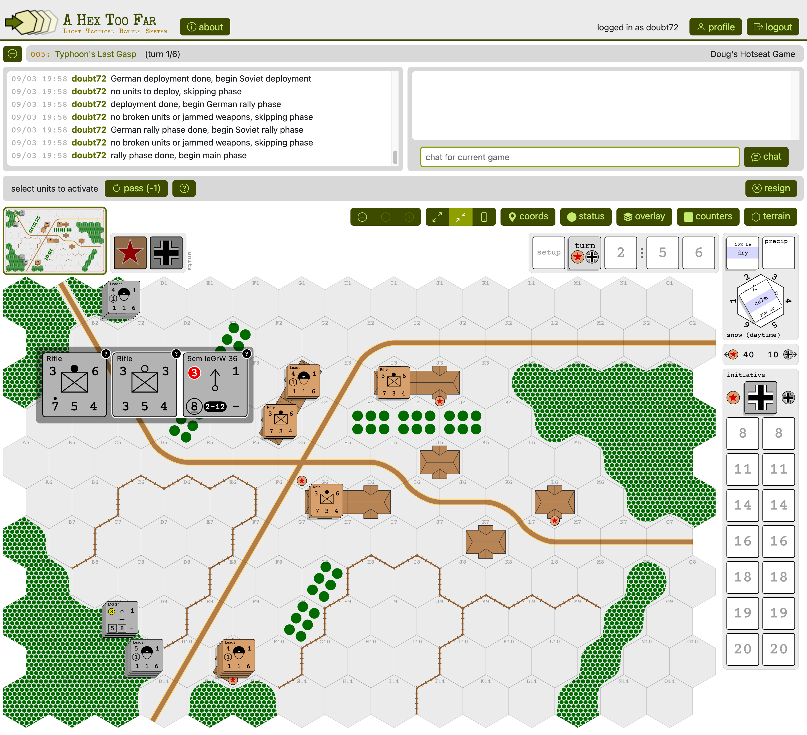
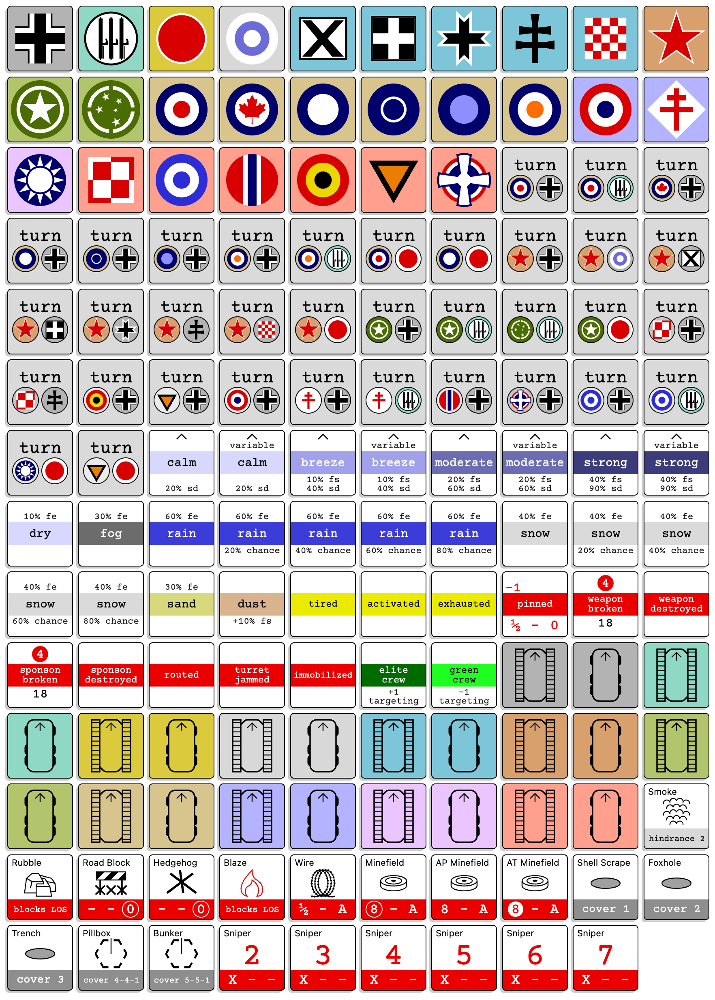

# README

`.tool-versions` has current versions of ruby, nodejs, yarn used.  I use asdf to
handle the installs.

Postgresql needs to be installed.

To get the server up and running, run:

```
bundle install
yarn
rake db:create
rake db:migrate
bin/dev
```

There is a git hook in support (`pre-commit`) which runs the linters and specs.
Can just be put in `.git/hooks`.

Probably could (always) do a bit more to clean up the code; this is definitely
the kind of dense code you can get away with when you're the only developer.
Some things were refactored when converting from JS to TS, but not everything.
But mostly leaving things that work alone, refactoring things as I go to make
continued development easier, or to handle new features, etc.

Might have been better off starting with more of an ECS model, but it is what it
is.  Interfacing hook-based react with game objects can be a bit sketchy
sometimes.

WIP:



LOS:


Some counter debug list displays:



